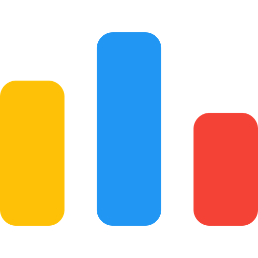

<h1 align="center">
  
</h1>

# I'm Tushar Sarkar, 
#### B.Sc. Engineering in CSE from Bangabandhu Sheikh Mujibur Rahman University of Science and Technology, Gopalganj.
- I'm pationate about C++, Java, c#, JavaScript, React.js, ASP.NET.
- I'm currently learning ASP.NET
- I'm competetive programmer.💻
- How to reach me: <a href="mailto: tusharcse35.bsmrstu@gmail.com">tusharcse35.bsmrstu@gmail.com</a>
- Here is my <a href="https://tushar35portfolio2.netlify.app/">Portfolio</a>

<h3>🌐 Connect With Me:</h3>
<h3 style="display:flex">
  <code><a href="https://www.linkedin.com/in/md-imran-hosen19/" title="LinkedIn Profile"> LinkedIn</a></code>
  <code style="margin-left:5px"><a href="https://codeforces.com/profile/md_imran_hosen19" title="Codeforces Profile"> Codeforces</a></code>
  <code style="margin-left:5px"><a href="https://leetcode.com/md_imran_hosen19/" title="Leetcode Profile">Leetcode</a></code>
  <code style="margin-left:5px"><a href="https://m.me/ImranHosen.Bsmrstu" title="Facebook Profile">Facebook</a></code>
</h3>

<h3>💻 Language & Tools:</h3>

  
  
  
  
  
  
  
  
  
  
  
  
  
  
  
  
  

<h2 align="center">⚡GitHub Stats⚡</h2>
 <table>
    <tr>
        <td valign="top">
            
        </td>
        <td valign="top">
            
        </td>
    </tr>
    <tr>
        <td valign="top">
            
        </td>
    </tr>
</table>
</h2>

